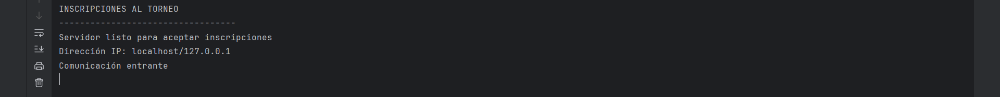
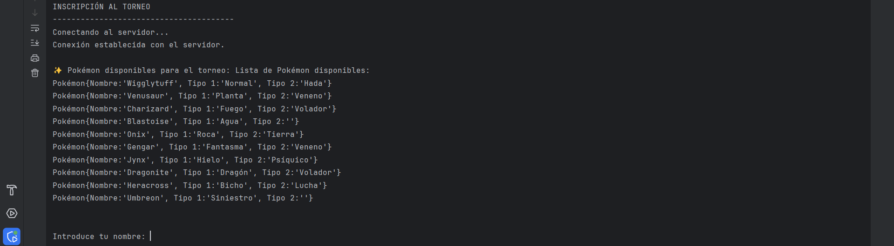
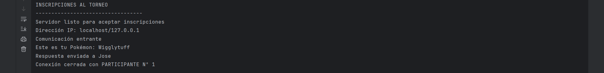
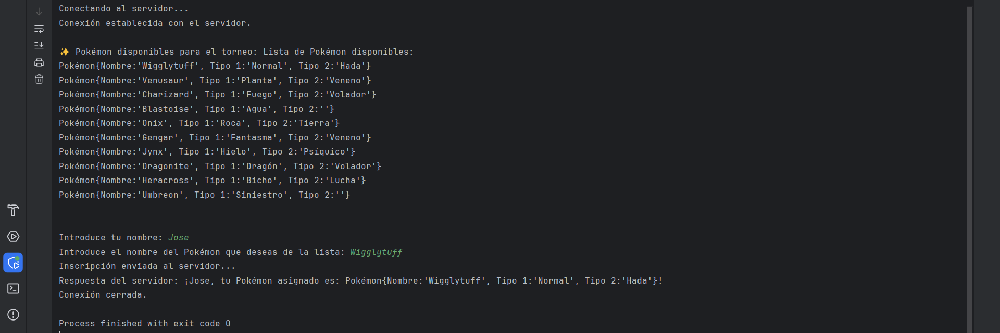

# Servidor Multihilo Pokémon

📚 Curso DAM – Programación de Servicios y Procesos (PSP)  
✍️ Entrega: desarrollo de un servidor multihilo (temática **Pokémon**).

## 🛠️ Tecnologías

## ⚙️ Funcionalidad
- El **servidor** mantiene un banco compartido de Pokémon.  
- Cada **cliente** puede conectarse y realizar inscripciones.  
- Se gestionan múltiples conexiones concurrentes gracias a **hilos**.  

## 📸 Vista previa
Ejecución en consola del servidor y un cliente conectándose:

Servidor estableciendo conexión

Cliente estableciendo conexión

Servidor escuchando la petición del cliente y enviando la respuesta

Cliente enviando la petición y recibiendo la respuesta del servidor

